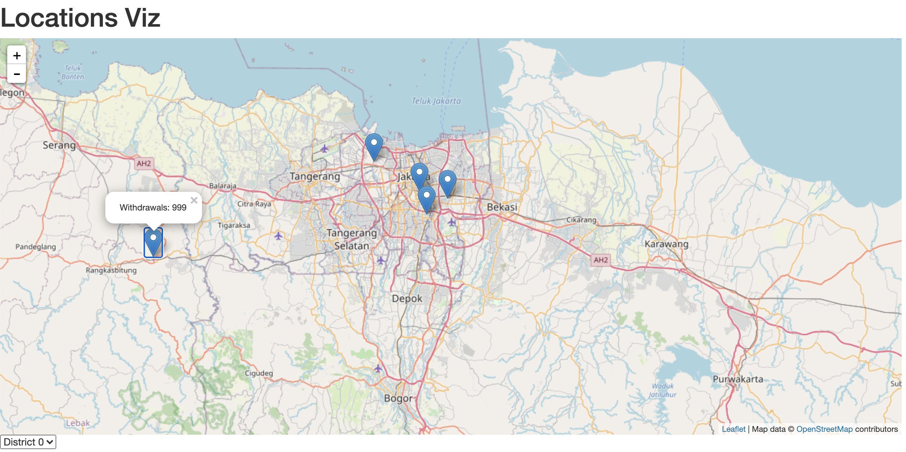

Flask - Leaflet - SQLite 
=================

Adapted from https://github.com/adwhit/flask-leaflet-demo

Install dependencies:

```
pip install flask flask-sqlalchemy --user
```

Create db: 

```
python demo.py mkdb
```

Start server:

```
python demo.py
```

View the demo by navigating to `http://localhost:5000`




